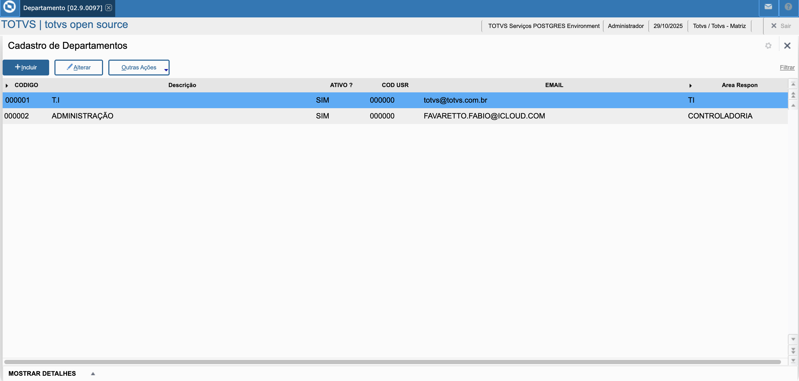
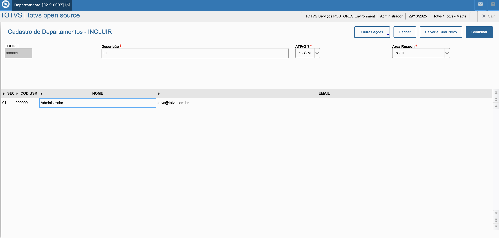

# Cadastro de Departamentos - Protheus

## Descrição

Este projeto implementa um cadastro completo de departamentos no Protheus utilizando o Framework MVC (Model-View-Controller). O sistema permite gerenciar departamentos com suas respectivas áreas responsáveis e usuários associados.

## Imagens do Projeto





## Funcionalidades

O cadastro de departamentos permite:

- **Gerenciamento de Departamentos (Cabeçalho)**:
  - Código do departamento (`ZZZ_COD`)
  - Descrição (`ZZZ_DESC`)
  - Status ativo/inativo (`ZZZ_ATIVO`)
  - Área responsável (`ZZZ_AREA`) - com opções pré-definidas via função `zDopc()`

- **Gestão de Usuários por Departamento (Grid/Itens)**:
  - Sequencial (`ZZZ_IDSEQ`) - incremento automático
  - Código do usuário (`ZZZ_USRID`)
  - Nome do usuário (`ZZZ_USRNOM`)
  - E-mail do usuário (`ZZZ_USRMAI`)

- **Operações Disponíveis**:
  - Visualizar departamentos
  - Incluir novos departamentos
  - Alterar departamentos existentes
  - Excluir departamentos

## Estrutura do Código

O código fonte principal está localizado em:

```
fonte/custom.configurador.departamentos.tlpp
```

### Componentes Principais

1. **CADZZZ()** - Função principal que inicializa o browse MVC
2. **MenuDef()** - Define as opções de menu (Visualizar, Incluir, Alterar, Excluir)
3. **ModelDef()** - Define o modelo de dados MVC (cabeçalho + grid)
4. **ViewDef()** - Define a visualização do formulário (campos do cabeçalho + grid)
5. **fModStruct()** - Estrutura dos campos da grid para o modelo
6. **fViewStruct()** - Estrutura dos campos da grid para visualização
7. **zDopc()** - Retorna as opções de área responsável (PDI, Comercial, Logística, etc.)

## Estrutura do Projeto

```
Totvs-departamento/
│
├── fonte/
│   └── custom.configurador.departamentos.tlpp    # Código fonte principal
│
├── images/
│   ├── departamentos-tela-principal.png        # Captura de tela principal
│   └── departamentos-grid-usuarios.png         # Captura de tela da grid de usuários
│
├── tabelas/
│   ├── six0101.sdb                              # Definição de índices (SIX)
│   ├── sx20101.sdb                              # Cadastro de tabelas (SX2)
│   └── sx30101.sdb                              # Cadastro de campos (SX3)
│
└── gestao de ambiente/
    ├── manifest_update.txt                      # Manifesto de atualização do projeto
    ├── sdfbra.txt                               # Definições de estruturas e campos
    ├── hlpdfpor.txt                             # Helps em português
    ├── hlpdfeng.txt                             # Helps em inglês
    ├── hlpdfspa.txt                             # Helps em espanhol
    └── mnupack.txt                              # Definições de menu (atualmente vazio)
```

## Tabela Utilizada

**Tabela:** `ZZZ`

### Campos do Cabeçalho:
- `ZZZ_FILIAL` - Filial
- `ZZZ_COD` - Código do Departamento (chave primária)
- `ZZZ_DESC` - Descrição
- `ZZZ_ATIVO` - Status (Sim/Não)
- `ZZZ_AREA` - Área Responsável (combo box com função `zDopc()`)

### Campos da Grid (Itens):
- `ZZZ_COD` - Código do Departamento (chave de relacionamento)
- `ZZZ_IDSEQ` - Sequencial (incremento automático)
- `ZZZ_USRID` - Código do Usuário
- `ZZZ_USRNOM` - Nome do Usuário
- `ZZZ_USRMAI` - E-mail do Usuário

## Áreas Responsáveis

A função `zDopc()` retorna as seguintes opções de área responsável:

1. PDI
2. COMERCIAL
3. LOGISTICA
4. CONTABIL
5. CONTROLADORIA
6. RH
7. FINANCEIRO
8. TI
9. JURIDICO
10. MARKETING
11. PRODUCAO
12. SUPRIMENTOS

## Instalação e Atualização

### Versão do Projeto
- **Versão:** 0002
- **Release de Referência:** 12.1.2510
- **Data de Criação:** 29/10/2025

### Processo de Atualização

Para atualizar o ambiente Protheus, utilize o arquivo de atualização que contém:

- **SIX:** Definição de índices (2 índices para a tabela ZZZ)
- **SX2:** Cadastro da tabela ZZZ
- **SX3:** Cadastro de todos os campos (9 campos)
- **SXB:** Definições de consultas (ZZZ01 e ZZZ1)
- **Helps:** Arquivos de ajuda multilíngue

### Componentes do Manifest

O arquivo `manifest_update.txt` detalha todos os componentes que serão atualizados no ambiente:

- Definição da tabela ZZZ
- Todos os campos necessários
- Índices para otimização de consultas
- Estruturas de ajuda (helps) em múltiplos idiomas

## Como Usar

1. Acesse o cadastro através da função `custom.configurador.departamentos.CADZZZ`
2. Navegue pelos departamentos existentes ou crie novos
3. Para cada departamento, você pode:
   - Definir código, descrição, status e área responsável
   - Incluir múltiplos usuários associados ao departamento na grid
4. O campo `ZZZ_IDSEQ` é preenchido automaticamente (incremento automático)

## Observações Técnicas

- Utiliza namespace `custom.configurador.departamentos`
- Framework MVC do Protheus (MPFormModel)
- Suporta até 99 itens por departamento
- Campo de incremento automático configurado na grid
- Validação de campos através das estruturas SX3

## Autor

**Fabio Favaretto**  
Versão 1.0 - 03/06/2025